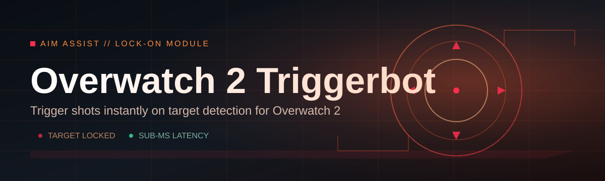
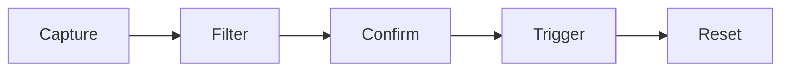

# overwatch2-trigger-assistant 🎯🛡️

  

*A weekend-built reflex layer for Overwatch 2 that closes the gap between "I saw them" and "I hit them."*

---

## 🧭 Overview

`overwatch2-trigger-assistant` started as a personal itch-scratch project — a way to test whether a lightweight, standalone triggerbot for Overwatch 2 could be built without dragging in a pile of dependencies, background services, or bloated launchers. What began as a few hundred lines of experimentation turned into a full tool with its own settings panel, hotkey engine, and detection pipeline. It's still, at heart, a proud little weekend project that grew up.

The core idea is simple: human reaction time has a floor, and for hitscan heroes in Overwatch 2, that floor is often the difference between a trade and a kill. This assistant watches a small screen region, recognizes when a valid target enters your crosshair, and fires the input the instant conditions are met. It's built for players who want to study frame-perfect timing, content creators testing hero mechanics in custom games, and tinkerers who enjoy reading how a triggerbot for Overwatch 2 is actually engineered under the hood.

This is not a competitive-ladder crutch dressed up in marketing language — it's a transparent, single-executable tool designed for controlled environments: practice range, custom lobbies, and personal review sessions. The project favors clarity over cleverness: no obfuscated logic, no telemetry, no hidden network calls. Just a focused piece of software that does one job precisely.

> [!NOTE]
> This project is maintained as an open, community-reviewed tool. The source of truth for downloads is always the landing page linked below — never a third-party mirror.

  

---

## ⚡ What It Actually Does

  

- **Color-space target locking** — instead of scanning full frames, it isolates a narrow pixel band around the crosshair and matches against a calibrated color signature, keeping CPU usage minimal.

- **Adjustable trigger latency** — a millisecond-level delay slider lets you simulate human-like response curves instead of a suspiciously instant snap.

- **Per-hero color profiles** — save distinct detection presets for different heroes and outfits, since enemy silhouettes and skins shift the color math.

- **Hold-to-arm activation** — the trigger only listens while a chosen key is physically held, so it never fires passively in the background.

- **Field-of-view radius control** — shrink or expand the detection circle so it hugs only the center reticle, avoiding accidental fires on peripheral movement.

- **Live overlay debugger** — a translucent on-screen box shows exactly what region is being sampled, which is invaluable when tuning sensitivity.

- **Zero-install portability** — a single `.exe`, no drivers, no background service installed to your system.

- **Profile import/export** — share a `.json` config with teammates or restore your own setup after a fresh Windows install.

> [!TIP]
> Start with a wide detection radius and a longer delay, then tighten both gradually. Most tuning frustration comes from skipping this step and going straight to aggressive settings.

---

## 🚀 Getting Started

1. Visit the landing page using the download button above.

2. Grab the latest build — it ships as a single portable executable, no bundled installer.

3. Run it once with Overwatch 2 already open in windowed or borderless mode.

4. Open the in-app calibration wizard, pick your hero's outfit color, and adjust the delay slider until it feels natural.

> [!IMPORTANT]
> Always run the assistant with the same display scaling and resolution you use in-game. Mismatched DPI settings are the number one cause of "it's not detecting anything" reports.

---

## 💻 System Requirements

| Component | Minimum | Recommended |
|---|---|---|
| OS | Windows 10 (64-bit) | Windows 11 (64-bit) |
| CPU | Dual-core 2.5GHz | Quad-core 3.2GHz+ |
| RAM | 4 GB | 8 GB+ |
| GPU | Any DirectX 11 capable | Dedicated GPU |
| Dependencies | None | None |
| Display | 1080p | 1080p–1440p |

The tool is entirely standalone — no runtime frameworks, no third-party libraries to fetch separately, no background services left running after you close it.

---

## 🛠️ How It Works

The pipeline behind the Overwatch 2 triggerbot logic is intentionally short so that latency stays low:

1. **Capture** a small pixel region centered on the crosshair using a lightweight screen-grab call.

2. **Filter** that region against your saved color profile to isolate a likely enemy silhouette.

3. **Confirm** the match persists for a couple of frames to reject noise, muzzle flashes, or particle effects.

4. **Trigger** the configured input the moment confirmation succeeds, respecting your delay setting.

5. **Reset** and return to idle capture, ready for the next frame cycle.

> [!WARNING]
> Running multiple screen-capture tools simultaneously (recording software, overlays, other capture utilities) can compete for the same capture API and introduce stutter. Close redundant overlays for the smoothest detection loop.

---

## 🧩 Common Pitfalls

<strong>The trigger never fires, even when I'm clearly on target.</strong>

 

Double-check your color profile — outfit skins, event cosmetics, and even in-game brightness settings can shift the sampled color enough to fail the match threshold. Recalibrate whenever you switch skins.

<strong>It fires on background objects, not just enemies.</strong>

 

Your detection radius is likely too wide, or your color tolerance is set too loosely. Shrink the radius first — it's the single most effective fix.

<strong>There's a noticeable stutter in Overwatch 2 while the assistant is running.</strong>

 

Lower the capture frequency in settings, or confirm no other overlay software is also hooking the screen. Two capture pipelines running at once is the usual culprit.

<strong>The overlay debugger box doesn't line up with my actual crosshair.</strong>

 

This almost always traces back to Windows display scaling. Set scaling to 100% for both Overwatch 2 and the assistant, then recalibrate.

<strong>My hold-to-arm key seems to get "stuck" active.</strong>

 

Some peripherals send duplicate key-down events. Try rebinding to a different key in Settings and see if the behavior persists.

<strong>Profiles I exported won't import on another PC.</strong>

 

Confirm both machines are running the same build version — the `.json` schema occasionally gains new fields between releases.

---

## 🎨 UI / UX Notes

- **Themes** — Slate Dark, Paper Light, and a high-contrast Colorblind-Assist mode.

- **Keyboard shortcuts:**

  | Action | Default Key |
  |---|---|
  | Arm/disarm trigger | Hold Right-Alt |
  | Open overlay debugger | F8 |
  | Cycle hero profile | F9 |
  | Toggle delay slider focus | F10 |
  | Open settings panel | F11 |

- **Settings persistence** — every profile, theme, and hotkey choice is saved locally in a single config file, no cloud account required.

- **Minimize-to-tray** — keeps the window out of your way during matches while remaining one click from reopening.

> [!TIP]
> The Colorblind-Assist theme also slightly boosts contrast in the overlay debugger box, which many users find easier to read even without colorblindness.

---

## 🌱 Contributing & Community

This project grew from a solo weekend build into something shaped by contributor feedback, calibration presets, and bug reports from people actually using it in custom lobbies. Contributions are genuinely welcome:

- Open an issue describing detection edge cases you've hit with specific heroes or skins.

- Submit pull requests for new color profiles, UI polish, or performance tuning.

- Share calibration presets that worked well for your monitor/resolution combo — these help newcomers skip the trial-and-error phase.

> [!NOTE]
> Please keep discussion focused on custom-game and practice-range use. Respect Blizzard's terms of service in any live, competitive context.

---

## 📄 License

Released under the [MIT License](LICENSE), 2026.

---

## ⚠️ Disclaimer

`overwatch2-trigger-assistant` is an independent, community-built tool and is not affiliated with, endorsed by, or sponsored by Blizzard Entertainment. It is provided for educational and personal practice purposes — reaction-time study, custom-game experimentation, and mechanics review. Use of any automation tool in Overwatch 2 may violate the game's terms of service; you are solely responsible for how and where you use this software. The maintainers assume no liability for account actions, bans, or other consequences resulting from its use.

  

